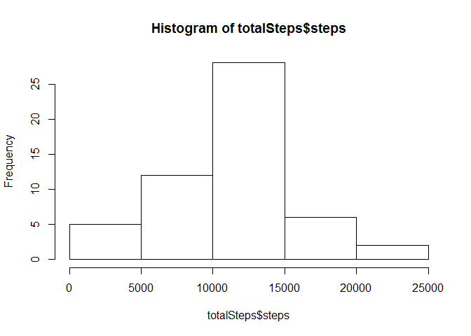

# Assignment=Activity Monitoring

###Load the data file into a data frame

```r
activity = read.csv("activity.csv")
```

### Calculate the total number of steps taken per day


```r
totalSteps <- aggregate(steps ~ date, data = activity, sum, na.rm = TRUE)
```

### Create a histogram of no of steps per day

```r
hist(totalSteps$steps)
```

<!-- -->


### Calculate the mean and median of the total number of steps taken per day

```r
mean(totalSteps$steps)
```

```
## [1] 10766.19
```

```r
median(totalSteps$steps)
```

```
## [1] 10765
```

###What is the average daily activity pattern?

```r
stepsInterval <- aggregate(steps ~ interval, data = activity, mean, na.rm = TRUE)
plot(steps ~ interval, data = stepsInterval, type = "l")
```

<!-- -->

###Imputting missing values - in this case mean is used to  fill up
####total missing value:-

```r
sum(is.na(activity$steps))
```

```
## [1] 2304
```


```r
interval2steps <- function(interval) {
    stepsInterval[stepsInterval$interval == interval, ]$steps
}
```

####Create a new dataset that is equal to the original dataset but with the missing data filled in.


```r
activityFilled <- activity  # Subset from the original data
count = 0  # Count the number of data filled in
for (i in 1:nrow(activityFilled)) {
    if (is.na(activityFilled[i, ]$steps)) {
        activityFilled[i, ]$steps <- interval2steps(activityFilled[i, ]$interval)
        count = count + 1
    }
}
cat("Total ", count, "NA values were filled.\n\r")
```

```
## Total  2304 NA values were filled.
## 
```

####Make a histogram of the total number of steps taken each day and Calculate and report the mean and median total number of steps taken per day.

```r
totalSteps2 <- aggregate(steps ~ date, data = activityFilled, sum)
hist(totalSteps2$steps)
```

<!-- -->


```r
mean(totalSteps2$steps)
```

```
## [1] 10766.19
```


```r
median(totalSteps2$steps)
```

```
## [1] 10766.19
```

###Are there differences in activity patterns between weekdays and weekends?
####Create a new factor variable in the dataset with two levels - "weekday" and "weekend" indicating whether a given date is a weekday or weekend day.

```r
activityFilled$day = ifelse(as.POSIXlt(as.Date(activityFilled$date))$wday%%6 == 
    0, "weekend", "weekday")
# For Sunday and Saturday : weekend, Other days : weekday
activityFilled$day = factor(activityFilled$day, levels = c("weekday", "weekend"))
```

####Make a panel plot containing a time series plot (i.e. type = "l") of the 5-minute interval (x-axis) and the average number of steps taken, averaged across all weekday days or weekend days (y-axis). 

```r
week_day_end_interval= aggregate(steps ~ interval + day, activityFilled, mean)
library(lattice)
xyplot(steps ~ interval | factor(day), data =week_day_end_interval, aspect = 1/2, type = "l")
```

<!-- -->
